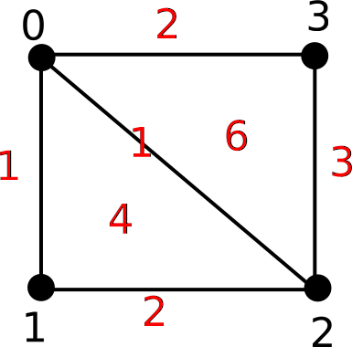

# phatcech (Pronounced "Fat Check")
Doing Cech Filtrations Wrapping around Phat (The Persistent Homology Algorithms Toolbox)

## Dependencies
* Numpy/Matplotlib
* PHAT (See below)

## Compiling PHAT
By default, the code calls a binary for phat from the command line, which you will need to compile.  This requires you to have CMake and OpenMP installed.  First, download and extract phat from this link: https://bitbucket.org/phat-code/phat.  Then, change into the phat directory and type

~~~~~ bash
mkdir build
cd build
cmake ..
make
~~~~~

This will generate a binary called "phat" in the build/ directory, which you will need to copy to the root of the PhatCech repository.  To test this, type
~~~~~ bash
python PhatCech.py
~~~~~

You should see the following image pop up:


## Running Custom Cech Filtrations
If you have a point cloud and a set of simplices with times at which they are added, you can call the function getCechDGMS() to compute the persistence diagrams associated to the Cech filtration you've defined (see doc string for more details).  For instance, assume we want to compute the Cech filtration where 4 vertices enter at time 0 and the edges and triangles are added in the pattern below:



Then we can execute the following code:

```python
from PhatCech import *
#Define simplices
simplices = [([0], 0), 
            ([1], 0), 
            ([2], 0), 
            ([3], 0), 
            ([0, 1], 1),
            ([0, 2], 1),
            ([1, 2], 2),
            ([0, 1, 2], 4),
            ([0, 3], 2),
            ([2, 3], 3),
            ([0, 2, 3], 6)]
#Compute persistence diagrams
Is = getCechDGMs(simplices, returnInfs = True)
print("H0:\n", Is[0])
print("H1:\n", Is[1])
```

The output is as follows:

```python
Computing persistence pairs...
Finished computing persistence pairs
H0:
 [[  0.   1.]
 [  0.   1.]
 [  0.   2.]
 [  0.  inf]]
H1:
 [[2 4]
 [3 6]]
```