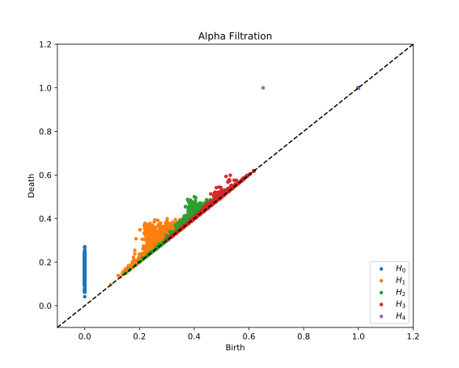

# phatcech (Pronounced "Fat Check")
The purpose of this code is to make it easy to run custom, non-Rips filtrations (e.g. Cech and Alpha) by wrapping around around Phat (The Persistent Homology Algorithms Toolbox).  Phat does most of the heavy lifting, but this code provides routines to construct and index simplices properly in a boundary matrix, as well as some plotting utilities.

## Dependencies
* Numpy/Matplotlib
* PHAT (See below)

## Testing
You will need to install the Python wrapper for <a href = "https://github.com/xoltar/phat/">Phat</a> using pip

~~~~~ bash
pip install phat
~~~~~

Then you can test it

~~~~~ bash
python PhatCech.py
~~~~~

The output is something like
```
Constructing boundary matrix...
Finished constructing boundary matrix (Elapsed Time 2.18)
Computing persistence pairs...
Finished computing persistence pairs (Elapsed Time 1.14)
```
And you should see the following image pop up:


## Running Custom Filtrations
If you have a point cloud and a set of simplices with times at which they are added, you can call the function get_phat_dgms() to compute the persistence diagrams associated to the custom filtration you've defined (see doc string for more details).  For instance, assume we want to compute a filtration where 4 vertices enter at time 0 and the edges and triangles are added in the pattern below (note how the triangles are not added the moment all of their edges are added, unlike Rips):


Then we can execute the following code:

```python
from PhatCech import *
#Define simplices
simplices = [([0], 0), 
            ([1], 0), 
            ([2], 0), 
            ([3], 0), 
            ([0, 1], 1),
            ([0, 2], 1),
            ([1, 2], 2),
            ([0, 1, 2], 4),
            ([0, 3], 2),
            ([2, 3], 3),
            ([0, 2, 3], 6)]
#Compute persistence diagrams
Is = get_phat_dgms(simplices, returnInfs = True)
print("H0:\n", Is[0])
print("H1:\n", Is[1])
```

The output is as follows:

```python
Computing persistence pairs...
Finished computing persistence pairs
H0:
 [[  0.   1.]
 [  0.   1.]
 [  0.   2.]
 [  0.  inf]]
H1:
 [[2 4]
 [3 6]]
```
Note that points that never die have a birth time which is "inf".  To exclude these, set returnInfs to false.

## Alpha Filtrations
Alpha filtrations are also supported.  This is the filtration that's obtained from the nerve of growing balls around points in Euclidean space which are the intersection of the Euclidean balls and the Voronoi regions around points.  In low ambient dimension, this filtration is much faster than the Rips filtration because there are far fewer simplices, though computing the Delaunay triangulation becomes more expensive in higher dimensions.

An example alpha filtration is below of 400 points sampled on a 4-sphere in 5 dimensions
```python
import numpy as np
import matplotlib.pyplot as plt
from PhatCech import alpha_filtration
from ripser import plot_dgms # (for plotting, must do "pip install ripser")

X = np.random.randn(400, 5)
X = X/np.sqrt(np.sum(X**2, 1)[:, None]) #Normalize points to the sphere
dgms = alpha_filtration(X)
plot_dgms([dgms[i] for i in range(len(dgms))])
plt.title("Alpha Filtration")
plt.show()
```

The output is 
```
Doing Delaunay triangulation...
Finished Delaunay triangulation (Elapsed Time 0.873)
Building alpha filtration...
Finished building alpha filtration (Elapsed Time 88.9)
Constructing boundary matrix...
Finished constructing boundary matrix (Elapsed Time 2.12)
Computing persistence pairs...
Finished computing persistence pairs (Elapsed Time 0.214)
```

And the persistence diagrams are


Note that up to H4 on 400 points would be intractible with Rips, even with <a href = "https://github.com/Ripser/ripser">ripser</a>.  But it runs in a reasonable amount of time with Alpha.  The bottleneck with Alpha is constructing the filtration and computing many circumcenters.  Note that computing the persistence pairs takes even less time than H1 for Rips with only 100 points shown above.

